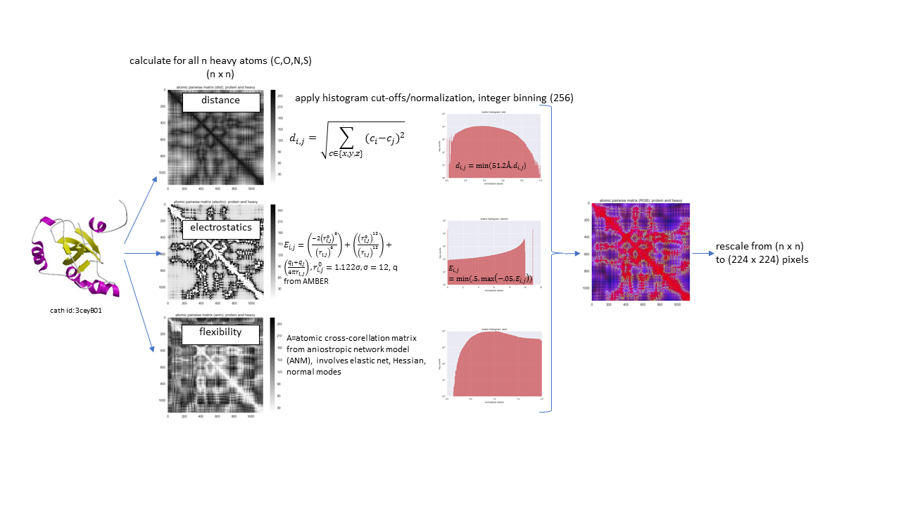
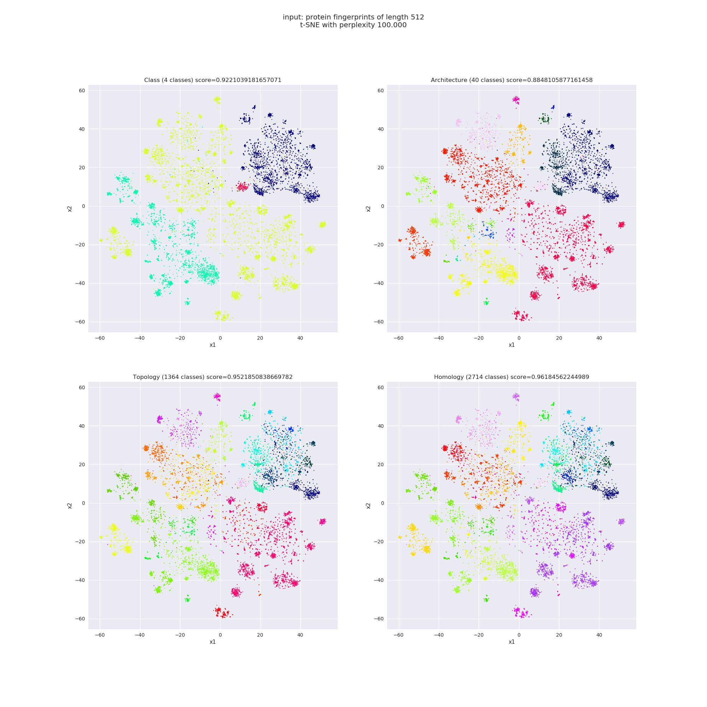
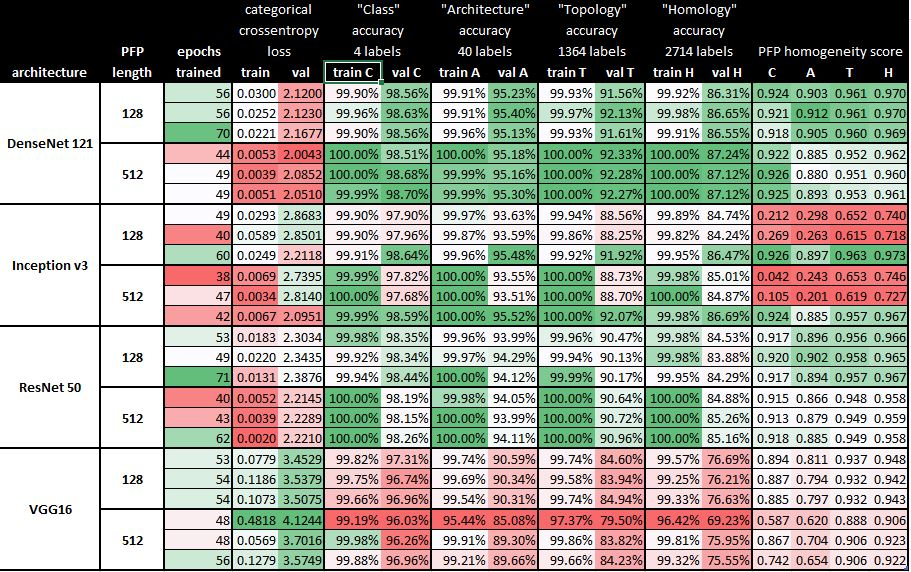

# Introduction 
ProtConv2D converts protein structures in PDB format into fingerprints of fixed length by using a 2D CNN as encoder on distance matrices. These fingerprints can be used as additional features in machine learning tasks that make predictions based on proteins (i.e. drug targets).

The usefulness of these fingerprints is demonstrated in a compound/target activity prediction exercise based on ChEMBL data.

# Getting Started
TODO: Guide users through getting your code up and running on their own system. In this section you can talk about:
1.	Installation process
2.	Software dependencies
3.	Latest releases
4.	API references

# Build and Test
TODO: Describe and show how to build your code and run the tests. 

# Contribute
TODO: Explain how other users and developers can contribute to make your code better. 

If you want to learn more about creating good readme files then refer the following [guidelines](https://www.visualstudio.com/en-us/docs/git/create-a-readme). You can also seek inspiration from the below readme files:
- [ASP.NET Core](https://github.com/aspnet/Home)
- [Visual Studio Code](https://github.com/Microsoft/vscode)
- [Chakra Core](https://github.com/Microsoft/ChakraCore)
